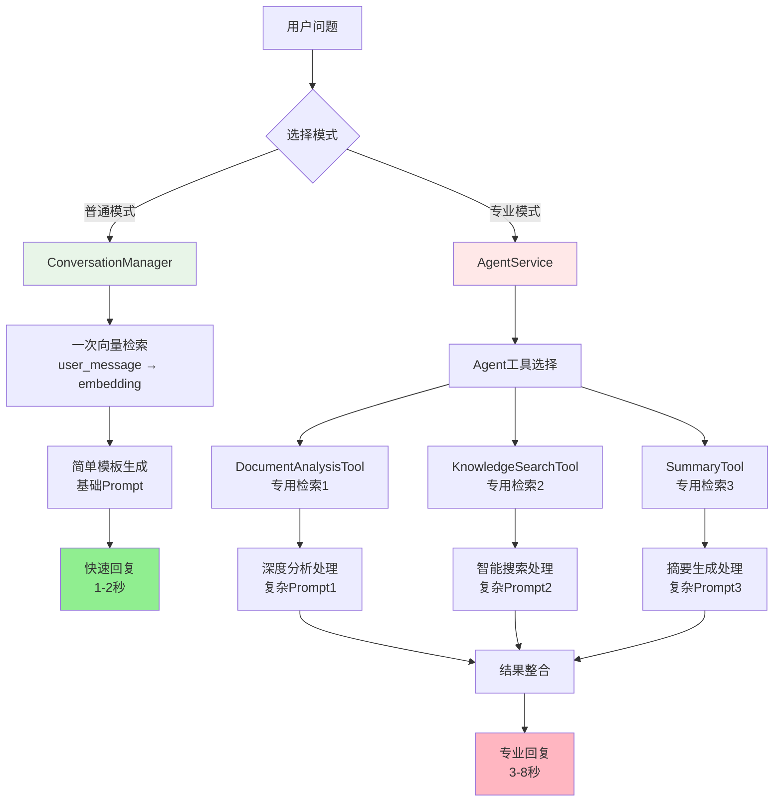
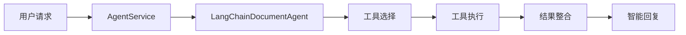
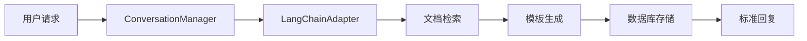

# 对话模式深度对比分析

## 📊 两种对话形式的架构设计

本项目采用了双对话路由设计，分别是基于智能Agent的对话模式和传统的会话管理模式。这种设计体现了现代AI应用"智能与效率并重"的设计理念。

## 🏗️ 架构层面的差异

### Agent Router (`/api/v1/agent/`)
- **路由文件**: `app/routers/agent_router.py`
- **服务层**: `AgentService` 
- **核心组件**: `LangChainDocumentAgent`
- **功能定位**: 智能Agent系统，支持工具链调用
- **主要接口**:
  - `POST /agent/chat` - Agent对话
  - `POST /agent/analyze` - 文档分析
  - `POST /agent/search` - 知识搜索
  - `POST /agent/summary` - 摘要生成

### Conversation Router (`/api/v1/conversations/`)
- **路由文件**: `app/routers/conversation_routes.py`
- **服务层**: `ConversationManager`
- **核心组件**: `LangChainAdapter`
- **功能定位**: 传统对话管理，专注会话持久化
- **主要接口**:
  - `POST /conversations/chat` - 普通对话
  - `GET /conversations/` - 对话列表
  - `GET /conversations/{id}/messages` - 消息历史

## 🤖 功能特性对比

| 特性 | Agent模式 | Conversation模式 |
|------|-----------|------------------|
| **工具调用** | ✅ 支持多工具链调用 | ❌ 仅基础检索 |
| **任务复杂度** | 🔥 复杂分析任务 | 📝 简单问答 |
| **智能程度** | 🧠 推理+工具协作 | 💬 模板化回复 |
| **会话管理** | 🗄️ Agent内存缓存 | 📚 数据库持久化 |
| **响应速度** | ⏰ 较慢（工具调用开销） | ⚡ 快速响应 |
| **资源消耗** | 🔋 高（缓存Agent实例） | 💨 轻量级 |
| **错误处理** | 🔄 工具链回退机制 | 🛡️ 简单异常处理 |
| **扩展性** | 🔧 高（工具可插拔） | 📐 中等 |

## ⚡ 性能开销深度分析

### **模式定位理解**
- **Conversation模式** = **普通模式**（快速、简单、日常使用）
- **Agent模式** = **专业模式**（深度、复杂、专业分析）

### **性能差异的根本原因**

Agent模式之所以更耗时、更耗性能，主要因为其工具链的设计：

#### **普通模式的处理流程**
```python
# 总耗时：约1-2秒
def generate_response(self, user_message):
    # 1. 一次向量检索 (~0.5秒)
    search_results = kb_manager.search_knowledge_base(
        query=user_message,  # 直接使用原始问题
        top_k=5
    )
    
    # 2. 简单模板拼接 (~0.1秒)
    prompt = f"基于检索结果回答问题: {user_message}"
    
    # 3. LLM生成 (~0.5-1秒)
    answer = llm.predict(prompt)
    
    # 4. 直接返回 (~0.1秒)
    return answer
```

#### **专业模式的处理流程**
```python
# 总耗时：约3-8秒
def chat_with_agent(self, user_message):
    # 1. Agent决策哪些工具需要使用 (~0.2秒)
    
    # 2. DocumentAnalysisTool执行
    #    - 向量检索1 (~0.5秒)
    #    - 深度分析处理 (~1-2秒)
    
    # 3. KnowledgeSearchTool执行  
    #    - 向量检索2 (~0.5秒)
    #    - 智能搜索处理 (~0.5秒)
    
    # 4. SummaryTool执行
    #    - 向量检索3 (~0.5秒) 
    #    - 摘要生成处理 (~1-2秒)
    
    # 5. 结果整合和最终生成 (~0.5秒)
    
    # 总计：多次检索 + 复杂处理
```

### **工具链检索分析**

Agent模式的三个工具都使用相同的检索模式，但针对不同任务优化：

```python
# 每个工具都要独立进行向量检索
class DocumentAnalysisTool(BaseTool):
    def _run(self, query: str):
        retriever = self.adapter.create_langchain_retriever(self.kb_id)
        docs = retriever.get_relevant_documents(query)  # 检索1
        # 深度分析处理 + 复杂prompt
        return analyzed_content

class KnowledgeSearchTool(BaseTool):
    def _run(self, query: str):
        retriever = self.adapter.create_langchain_retriever(self.kb_id)
        docs = retriever.get_relevant_documents(query)  # 检索2
        # 智能搜索 + 结果格式化
        return formatted_results

class SummaryTool(BaseTool):
    def _run(self, query: str):
        retriever = self.adapter.create_langchain_retriever(self.kb_id)
        docs = retriever.get_relevant_documents("文档主要内容 核心观点")  # 检索3
        # 摘要生成 + 学术格式化
        return summary
```

### **性能对比数据表**

| 维度 | 普通模式 | 专业模式 | 差异倍数 |
|------|----------|----------|----------|
| **向量检索次数** | 1次 | 3次+ | 3倍+ |
| **LLM调用次数** | 1次 | 3-4次 | 3-4倍 |
| **处理时间** | 1-2秒 | 3-8秒 | 3-4倍 |
| **内存使用** | 低 | 高（缓存Agent实例） | 2-3倍 |
| **CPU使用** | 低 | 高（多工具并行） | 2-4倍 |
| **Prompt复杂度** | 简单模板 | 专业化多轮Prompt | 5-10倍 |

### **检索层次差异图解**



## 🛠️ Agent模式的核心能力

Agent模式配备了三个专业工具，支持复杂的智能任务：

### 1. DocumentAnalysisTool - 深度文档分析
```python
# 功能特性：
- 结构化文档分析
- 实体关系提取  
- 学术内容理解
- 上下文推理分析
```

### 2. KnowledgeSearchTool - 智能知识搜索
```python
# 功能特性：
- 语义理解搜索
- 多轮检索优化
- 结果相关性排序
- 跨文档信息整合
```

### 3. SummaryTool - 智能摘要生成
```python
# 功能特性：
- 多层次摘要生成
- 学术规范格式
- 核心观点提取
- 创新点识别
```

## 💬 Conversation模式的设计重点

Conversation模式专注于传统的对话管理和会话持久化：

### 核心功能
```python
class ConversationManager:
    # 1. 对话持久化 - 完整的CRUD操作
    def create_conversation()
    def list_conversations()
    def get_conversation()
    def update_conversation()
    def delete_conversation()
    
    # 2. 消息历史 - 数据库存储和检索
    def add_message()
    def get_conversation_history()
    
    # 3. 上下文维护 - 多轮对话连续性
    def get_conversation_context()
    
    # 4. 流式支持 - 实时响应体验
    def generate_response(stream=True)
```

## 🎯 设计原因分析

### 1. 功能职责分离
- **Agent模式**: 专注复杂智能任务处理，提供深度分析能力
- **Conversation模式**: 专注会话状态管理，提供稳定的对话体验

### 2. 性能优化策略
- **Agent模式**: 
  - 实例缓存机制（`AgentCacheManager`）
  - 工具链复用
  - 智能回退策略
- **Conversation模式**: 
  - 轻量级快速响应
  - 数据库优化查询
  - 简单模板生成

### 3. 用户体验考虑
- **Agent模式**: 专业分析工具，适合研究人员深度使用
- **Conversation模式**: 日常对话交互，支持多轮连续对话

### 4. 系统可扩展性
- **Agent模式**: 工具可插拔设计，功能模块化扩展
- **Conversation模式**: 简单稳定架构，易于维护和部署

## 🚀 **为什么要这样设计？**

### **用户需求层次不同**
```python
# 普通模式：满足日常快速问答
"这个文档讲了什么？" 
→ 快速回复，1-2秒，满足基本信息需求

# 专业模式：满足深度分析需求  
"请分析这篇论文的创新点、方法论和实验结果，并与相关研究对比" 
→ 深度分析，5-8秒，提供专业洞察
```

### **质量vs效率的权衡**
- **普通模式**：效率优先，"够用就好"的设计理念
- **专业模式**：质量优先，"精准深入"的分析要求

### **资源使用策略差异**
```python
# 普通模式：即用即走，轻量级设计
def simple_chat():
    result = quick_search_and_generate()
    return result  # 不占用持续资源

# 专业模式：缓存复用，重型应用设计
class AgentService:
    def __init__(self):
        # 缓存Agent实例，避免重复初始化开销
        self.cache_manager = AgentCacheManager()  
    
    def get_agent(self, kb_id, llm_type):
        # 复用已创建的Agent，提高后续请求效率
        return self.cache_manager.get_agent(kb_id, llm_type)
```

## 🔧 **项目中的性能优化实现**

### **1. Agent实例缓存机制**
```python
class AgentCacheManager:
    def __init__(self):
        self._cache: Dict[str, LangChainDocumentAgent] = {}
    
    def get_agent(self, kb_id: str, llm_type: str):
        cache_key = f"{kb_id}:{llm_type}"
        if cache_key not in self._cache:
            # 只在第一次创建，后续复用
            self._cache[cache_key] = LangChainDocumentAgent(kb_id, llm_type)
            logger.info(f"创建新的Agent实例: {cache_key}")
        return self._cache[cache_key]
```

### **2. 检索器缓存优化**
```python
class LangChainAdapter:
    def __init__(self):
        self.retrievers = {}  # 缓存检索器实例
    
    def create_langchain_retriever(self, kb_id: str):
        if kb_id in self.retrievers:
            return self.retrievers[kb_id]  # 复用已创建的检索器
        
        # 创建新检索器并缓存，避免重复初始化开销
        retriever = self._create_safe_retriever(kb_id)
        self.retrievers[kb_id] = retriever
        return retriever
```

### **3. 智能回退机制**
```python
def chat(self, message, use_agent=True):
    if use_agent:
        try:
            # 尝试专业模式（多工具链调用）
            return self.agent_response(message)
        except Exception as agent_error:
            logger.warning(f"Agent模式失败，回退到普通模式: {agent_error}")
            # 自动回退到普通模式（单次检索）
            return self.simple_response(message)
    else:
        # 直接使用普通模式
        return self.simple_response(message)
```

### **4. 工具链优化策略**
```python
# Agent工具都使用相同的检索器缓存
class DocumentAnalysisTool(BaseTool):
    def _run(self, query: str):
        # 复用缓存的检索器，避免重复创建
        retriever = self.adapter.create_langchain_retriever(self.kb_id)
        docs = retriever.get_relevant_documents(query)
        
        # 专业化的分析处理
        context = "\n\n".join([doc.page_content for doc in docs[:3]])
        prompt = ChatPromptTemplate.from_template("""
        基于以下文档内容，请回答用户的问题或完成分析任务：
        文档内容：{context}
        用户请求：{query}
        请提供准确、详细的分析结果：
        """)
        # ... 复杂的分析逻辑
```

## 🔄 实际运行流程对比

### Agent模式流程


### Conversation模式流程


## 📈 使用场景建议

### 选择Agent模式当需要：
- 📊 深度文档分析和理解
- 🧠 执行复杂推理任务
- 🔗 多工具协作完成任务
- 🎯 追求高度智能化
- 📝 生成结构化报告
- 🔍 跨文档信息整合

### 选择Conversation模式当需要：
- 💬 日常问答交互
- 📚 会话历史持久化
- ⚡ 快速响应体验
- 💰 控制资源使用
- 📱 简单易用的界面
- 🔄 稳定可靠的服务

## 🚀 技术实现细节

### Agent模式技术栈
- **核心框架**: LangChain Agent框架
- **工具系统**: BaseTool继承体系
- **内存管理**: ConversationBufferMemory
- **执行引擎**: AgentExecutor
- **缓存策略**: 实例级缓存

### Conversation模式技术栈
- **数据持久化**: PostgreSQL + SQLAlchemy
- **会话管理**: 数据库事务管理
- **流式处理**: FastAPI StreamingResponse
- **上下文处理**: 简单模板系统
- **性能优化**: 查询优化 + 分页

## 📝 总结

这种双路由设计充分体现了现代AI应用架构的**"智能与效率并重"**理念：

### **核心设计原则**
1. **Agent模式（专业模式）**：
   - 🎯 **深度优先**：多工具链协作，3-8秒深度分析
   - 🧠 **质量导向**：复杂Prompt工程，专业化处理
   - 🔧 **可扩展性**：工具可插拔，功能模块化
   - 💾 **缓存优化**：实例复用，减少重复开销

2. **Conversation模式（普通模式）**：
   - ⚡ **效率优先**：单次检索，1-2秒快速响应
   - 💬 **体验导向**：简单模板，流畅交互
   - 📚 **持久化强**：完整会话管理，数据库集成
   - 💨 **轻量级**：最小资源占用，即用即走

### **性能与功能的平衡**
- **3-4倍的性能开销**换取**5-10倍的分析深度**
- **专业化工具链**满足**研究级别的文档分析需求**
- **智能回退机制**确保**系统稳定性和可靠性**
- **缓存策略**优化**重复请求的性能表现**

### **实际应用价值**
1. **满足不同用户群体**：
   - 研究人员 → Agent模式的深度分析
   - 普通用户 → Conversation模式的快速问答

2. **覆盖不同使用场景**：
   - 专业分析 → 学术论文解读、复杂问题研究
   - 日常交互 → 快速查询、简单问答

3. **实现系统可持续发展**：
   - 架构设计清晰，便于功能扩展
   - 性能优化充分，支持规模化部署
   - 用户体验优良，满足长期使用需求

通过这种**"普通模式+专业模式"**的双轨设计，系统真正实现了**智能化与实用性的完美平衡**，既能处理复杂的学术文档分析任务，又能提供流畅的日常对话体验。这种设计理念为AI应用的架构设计提供了优秀的参考模式。 