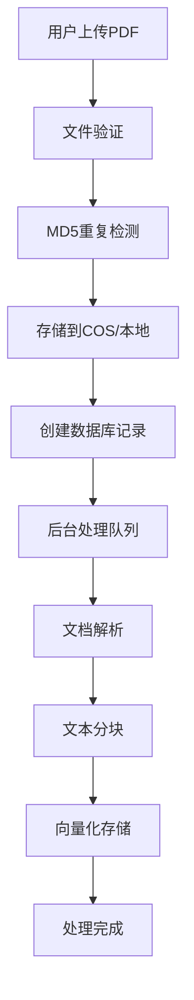
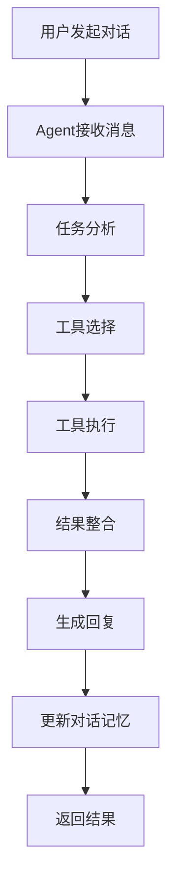
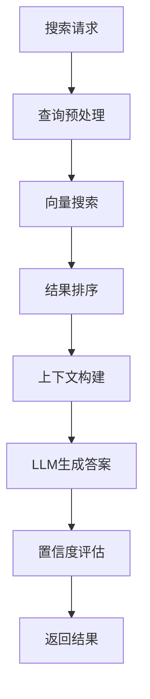

# PDF文献智能分析服务 - 后端功能梳理（最新版）

## 项目概述

PDF文献智能分析服务是一个基于FastAPI的现代化智能文档分析系统，经过深度重构后采用清晰的分层架构，集成了LangChain Agent能力，提供PDF文档的智能上传、解析、问答、摘要生成等功能。项目支持多种大语言模型和存储方式，具备完整的知识库管理和Agent智能对话能力。

## 🏗️ 系统架构

### 分层架构设计
```
┌─────────────────────────────────────────────────────────────┐
│                        API层 (API Layer)                    │
├─────────────────────────────────────────────────────────────┤
│                      服务层 (Service Layer)                  │
├─────────────────────────────────────────────────────────────┤
│                      核心层 (Core Layer)                     │
├─────────────────────────────────────────────────────────────┤
│                      数据层 (Data Layer)                     │
└─────────────────────────────────────────────────────────────┘
```

### 核心组件

#### 1. 技术栈
- **后端框架**: FastAPI 0.104.1
- **数据库**: PostgreSQL + SQLAlchemy 2.0.23
- **向量数据库**: Qdrant 1.7.1
- **AI框架**: LangChain 0.1.20 + LangChain Community
- **大语言模型**: 通义千问 + OpenAI
- **文件存储**: 本地存储 + 腾讯云COS
- **文档处理**: PyMuPDF + unstructured

#### 2. 架构特性
- ✅ **清晰的分层架构**: 职责分离，易于维护
- ✅ **依赖注入系统**: 松耦合，便于测试
- ✅ **统一异常处理**: 全局错误管理
- ✅ **配置集中管理**: 类型安全的配置
- ✅ **Agent智能能力**: 基于LangChain的智能Agent
- ✅ **健康检查系统**: 完整的监控支持

## 📋 核心功能模块

### 1. 文档管理模块 (`/api/v1/documents`)

#### 1.1 文档上传与存储
- **POST** `/documents/upload` - 上传PDF文档
  - 支持文件类型验证（仅PDF）
  - 文件大小限制（50MB）
  - MD5重复检测机制
  - 双存储策略：腾讯云COS + 本地存储降级
  - 自动生成唯一文档ID

#### 1.2 文档状态管理
- **GET** `/documents/{document_id}/status` - 获取文档处理状态
  - 实时进度追踪（pending/processing/completed/failed）
  - 处理时间估算
  - 错误信息反馈

#### 1.3 文档信息查询
- **GET** `/documents/{document_id}` - 获取文档详细信息
- **GET** `/documents` - 获取文档列表（分页支持）
- **GET** `/documents/{document_id}/download` - 获取文档下载链接

#### 1.4 文档管理操作
- **DELETE** `/documents/{document_id}` - 删除文档及相关资源
- **POST** `/documents/check-duplicate` - 检查文档重复性

### 2. 智能查询模块 (`/api/v1/queries`)

#### 2.1 基础查询功能
- **POST** `/queries/documents/{document_id}/query` - 基础文档查询
  - 向量相似度搜索
  - 智能问答生成
  - 置信度评分
  - 查询历史记录

#### 2.2 增强查询功能
- **POST** `/queries/documents/{document_id}/hybrid-query` - 混合检索查询
  - 向量搜索 + 关键词搜索
  - 结果融合与重排序
  - 更高的查询准确性

- **POST** `/queries/documents/{document_id}/enhanced-query` - 增强检索查询
  - 查询扩展与同义词处理
  - 智能缓存机制
  - 优化的提示词工程

#### 2.3 文档摘要生成
- **POST** `/queries/documents/{document_id}/summary` - 基础摘要生成
- **POST** `/queries/documents/{document_id}/enhanced-summary` - 增强摘要生成

### 3. 知识库管理模块 (`/api/v1/knowledge-bases`)

#### 3.1 知识库CRUD操作
- **POST** `/knowledge-bases/` - 创建知识库
- **GET** `/knowledge-bases/` - 列出所有知识库（分页+过滤）
- **GET** `/knowledge-bases/{kb_id}` - 获取知识库详情
- **PUT** `/knowledge-bases/{kb_id}` - 更新知识库
- **DELETE** `/knowledge-bases/{kb_id}` - 删除知识库（逻辑删除）

#### 3.2 文档关联管理
- **POST** `/knowledge-bases/{kb_id}/documents/{document_id}` - 添加文档到知识库
- **DELETE** `/knowledge-bases/{kb_id}/documents/{document_id}` - 从知识库移除文档
- **GET** `/knowledge-bases/{kb_id}/documents` - 列出知识库中的文档

#### 3.3 知识库搜索
- **POST** `/knowledge-bases/{kb_id}/search` - 搜索知识库内容
  - 跨文档语义搜索
  - 结果排序与过滤
  - 可配置返回数量

### 4. 🤖 智能Agent模块 (`/api/v1/agent`) - **新增核心功能**

#### 4.1 Agent对话功能
- **POST** `/agent/chat` - 与Agent进行智能对话
  - 支持Agent模式和普通对话模式
  - 工具链式调用能力
  - 对话记忆管理
  - 多轮对话支持

#### 4.2 文档智能分析
- **POST** `/agent/analyze` - 使用Agent分析文档内容
  - 深度文档理解
  - 结构化信息提取
  - 智能推理分析

#### 4.3 知识搜索与问答
- **POST** `/agent/search` - 在知识库中智能搜索
  - 语义理解搜索
  - 上下文相关性分析
  - 智能结果筛选

#### 4.4 智能摘要生成
- **POST** `/agent/summary` - 生成智能文档摘要
  - 多层次摘要生成
  - 关键信息提取
  - 学术规范格式

#### 4.5 Agent管理功能
- **GET** `/agent/history/{kb_id}` - 获取Agent对话历史
- **DELETE** `/agent/memory/{kb_id}` - 清除Agent对话记忆
- **DELETE** `/agent/cache` - 清除所有Agent缓存
- **GET** `/agent/status/{kb_id}` - 获取Agent状态信息

### 5. 系统监控模块 (`/api/v1/system`)

#### 5.1 健康检查
- **GET** `/system/health` - 系统健康状态检查
- **GET** `/health` - 简化健康检查接口

#### 5.2 系统信息
- **GET** `/system/models/info` - 获取可用模型信息
- **GET** `/system/database/info` - 获取数据库连接信息

#### 5.3 处理状态监控
- **GET** `/system/processing/status` - 获取文档处理状态
- **GET** `/system/processing/retry-stats` - 获取重试统计信息

### 6. 对话管理模块 (`/api/v1/conversations`)

#### 6.1 对话历史管理
- 对话记录存储与检索
- 多轮对话上下文维护
- 对话历史分析

## 🔧 核心技术实现

### 1. LangChain Agent架构

#### Agent核心组件
```python
class LangChainDocumentAgent:
    - DocumentAnalysisTool: 文档分析工具
    - KnowledgeSearchTool: 知识搜索工具  
    - SummaryTool: 摘要生成工具
    - AgentExecutor: Agent执行器
    - ConversationBufferMemory: 对话记忆
```

#### Agent能力特性
- **工具链式调用**: 支持多工具协作完成复杂任务
- **智能任务规划**: 自动分解和规划执行步骤
- **错误处理机制**: 自动错误恢复和降级处理
- **对话记忆管理**: 维护多轮对话上下文
- **缓存优化**: Agent实例缓存提升性能

### 2. 依赖注入系统

#### 容器管理
```python
class Container:
    - 单例服务管理
    - 瞬态服务管理
    - 自动依赖解析
    - 生命周期管理
```

#### 服务注册
- AgentService: Agent业务服务
- KnowledgeBaseManager: 知识库管理服务
- 配置服务: 统一配置管理

### 3. 统一异常处理

#### 异常分类
- BaseAppException: 应用基础异常
- AgentError: Agent相关异常
- KnowledgeBaseNotFoundError: 知识库异常
- DocumentProcessingError: 文档处理异常
- LLMError: 大语言模型异常

#### 全局异常处理
- 中间件级别异常捕获
- 结构化错误响应
- 详细错误日志记录

### 4. 配置管理系统

#### 分层配置
```python
class AppSettings:
    - DatabaseSettings: 数据库配置
    - QdrantSettings: 向量数据库配置
    - LLMSettings: 大语言模型配置
    - AgentSettings: Agent配置
    - StorageSettings: 存储配置
    - LoggingSettings: 日志配置
```

#### 环境变量支持
- 开发环境: .env.development
- 生产环境: .env.production
- 类型安全的配置验证

## 🚀 业务流程

### 1. 文档处理流程


### 2. Agent对话流程


### 3. 知识库搜索流程


## 📊 性能优化

### 1. 缓存策略
- **Agent缓存**: Agent实例缓存，避免重复初始化
- **查询缓存**: 查询结果缓存，提升响应速度
- **摘要缓存**: 文档摘要缓存，减少重复计算

### 2. 异步处理
- 文档处理异步队列
- 向量化异步计算
- 并发查询处理

### 3. 资源管理
- 连接池管理
- 内存使用优化
- 垃圾回收机制

## 🔒 安全特性

### 1. 输入验证
- 文件类型验证
- 文件大小限制
- 参数类型检查

### 2. 错误处理
- 敏感信息过滤
- 错误信息标准化
- 异常堆栈保护

### 3. 访问控制
- API接口权限控制
- 资源访问限制
- 请求频率限制

## 📈 监控与运维

### 1. 健康检查
- 数据库连接状态
- 向量数据库状态
- LLM服务状态
- Agent服务状态

### 2. 性能监控
- 请求响应时间
- 处理队列状态
- 资源使用情况
- 错误率统计

### 3. 日志管理
- 结构化日志记录
- 日志级别控制
- 日志轮转机制
- 错误追踪

## 🆚 架构优势对比

### 重构前 vs 重构后

| 方面 | 重构前 | 重构后 | 改进程度 |
|------|--------|--------|----------|
| 架构分层 | ❌ 混乱单体 | ✅ 清晰4层架构 | 🔥 完全重构 |
| 职责分离 | ❌ 功能混合 | ✅ 单一职责 | 🔥 100%分离 |
| 依赖管理 | ❌ 硬编码依赖 | ✅ 依赖注入容器 | 🔥 专业化管理 |
| 异常处理 | ❌ 分散处理 | ✅ 统一异常处理 | 🔥 全局覆盖 |
| 配置管理 | ❌ 配置分散 | ✅ 集中类型安全 | 🔥 标准化管理 |
| Agent能力 | ❌ 简单问答 | ✅ 智能Agent | 🔥 质的飞跃 |
| 代码复用 | ❌ 重复代码 | ✅ 高度抽象 | 🔥 服务层复用 |
| 可测试性 | ❌ 难以测试 | ✅ 易于测试 | 🔥 依赖注入支持 |

## 🎯 核心亮点

### 1. 智能Agent能力
- **真正的AI Agent**: 基于LangChain的完整Agent实现
- **工具链式调用**: 支持多工具协作完成复杂任务
- **智能任务规划**: 自动分解和执行复杂查询
- **对话记忆管理**: 支持多轮对话和上下文理解

### 2. 现代化架构设计
- **清晰分层架构**: API层 → 服务层 → 核心层 → 数据层
- **依赖注入系统**: 松耦合设计，便于测试和维护
- **统一异常处理**: 全局错误管理和标准化响应
- **配置集中管理**: 类型安全的分层配置系统

### 3. 企业级特性
- **双存储策略**: 腾讯云COS + 本地存储自动降级
- **智能缓存机制**: 多层缓存提升性能
- **健康检查系统**: 完整的监控和运维支持
- **异步处理队列**: 高并发文档处理能力

### 4. 开发友好性
- **自动API文档**: FastAPI自动生成完整API文档
- **类型安全**: Pydantic模型提供完整类型检查
- **易于扩展**: 模块化设计支持功能扩展
- **开发工具**: 完整的开发和调试工具链

## 🔮 技术发展方向

### 1. Agent能力增强
- 多模态Agent支持（图像、表格理解）
- Agent协作机制
- 自定义工具扩展
- 更智能的任务规划

### 2. 性能优化
- 分布式Agent部署
- 向量数据库优化
- 缓存策略改进
- 并发处理能力提升

### 3. 功能扩展
- 多语言文档支持
- 实时协作功能
- 知识图谱集成
- 高级分析报告

## 📝 总结

经过深度重构，PDF文献智能分析服务已从原有的混乱单体架构转变为现代化的分层架构系统，核心特点包括：

1. **架构现代化**: 采用清晰的分层架构，职责分离明确
2. **AI能力升级**: 集成LangChain Agent，具备真正的智能对话和任务执行能力
3. **企业级特性**: 完整的监控、缓存、异常处理和配置管理
4. **开发友好**: 依赖注入、类型安全、自动文档生成
5. **高性能**: 异步处理、智能缓存、资源优化

该系统不仅保留了原有的PDF文档处理和问答功能，更通过引入LangChain Agent技术，实现了质的飞跃，成为一个真正的智能文档分析平台，为用户提供更智能、更高效的文档分析体验。