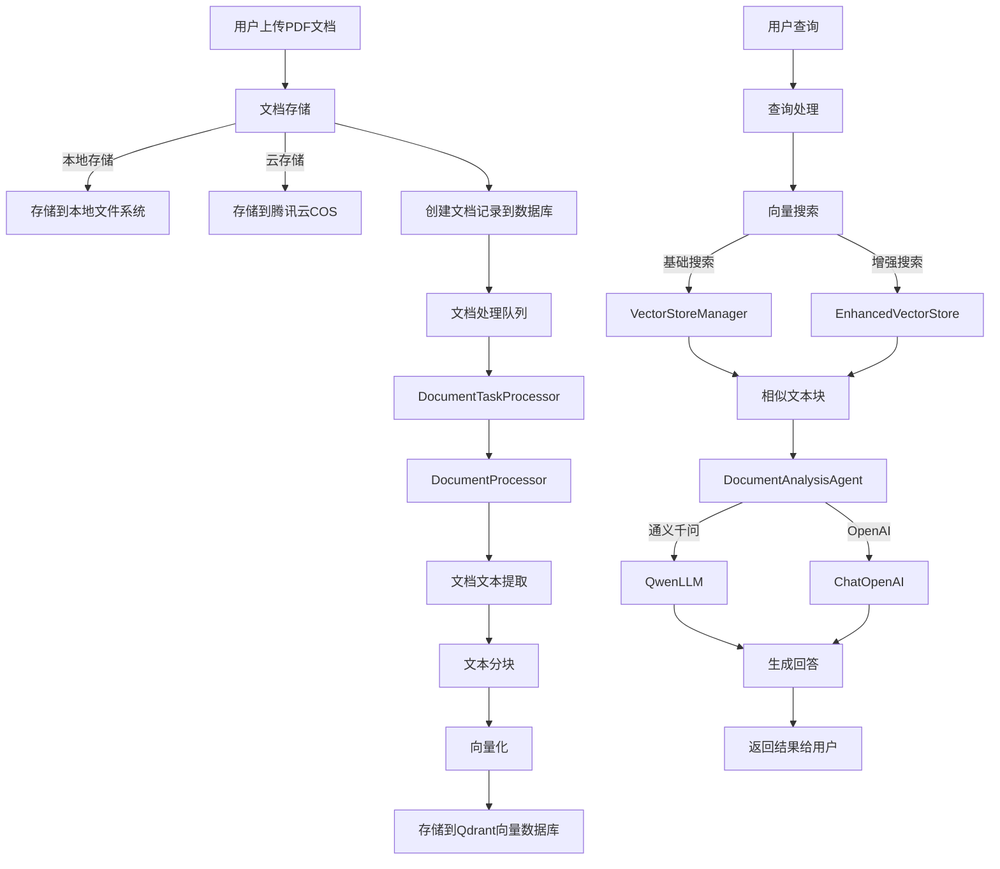

# llama-pdf 项目功能梳理

## 项目概述

llama-pdf 是一个基于 FastAPI 的 PDF 文档分析系统，通过向量化文档内容并结合大语言模型，实现对 PDF 文档的智能查询、摘要生成等功能。项目支持多种大模型（包括通义千问和 OpenAI）以及多种存储方式（本地存储和腾讯云 COS）。

## 核心组件

### 1. 系统架构

- **后端框架**：FastAPI
- **数据库**：支持 SQLite 和 PostgreSQL
- **向量数据库**：Qdrant
- **大语言模型**：支持通义千问和 OpenAI
- **文件存储**：支持本地文件系统和腾讯云 COS

### 2. 数据模型

- **Document**：文档模型，存储文档的元数据、状态和处理信息
- **QueryHistory**：查询历史记录模型，存储用户的查询和系统的回答

### 3. 核心功能模块

#### 3.1 文档处理流程

1. **文档上传**：
   - 接收用户上传的 PDF 文件
   - 计算文件 MD5 值，检查是否重复
   - 根据配置选择存储到本地文件系统或腾讯云 COS
   - 创建文档记录到数据库，初始状态为 "pending"

2. **文档处理**：
   - `DocumentTaskProcessor` 定时轮询待处理文档
   - 调用 `DocumentProcessor` 处理文档
   - 提取文本内容，包括结构化信息（标题、段落等）
   - 对文本进行分块处理，生成语义连贯的文本块
   - 对每个文本块生成关键词和摘要
   - 计算文本质量分数

3. **向量化存储**：
   - 使用 `VectorStoreManager` 创建文档的向量集合
   - 通过嵌入模型（通义千问或 OpenAI）将文本块转换为向量
   - 将向量和元数据存储到 Qdrant 向量数据库

#### 3.2 文档查询流程

1. **基础查询**：
   - 接收用户的问题
   - 使用 `VectorStoreManager` 在向量数据库中搜索相似文本块
   - 将相似文本块作为上下文，调用 `DocumentAnalysisAgent` 生成回答

2. **增强查询**：
   - 使用 `EnhancedVectorStore` 进行混合检索（向量搜索 + 关键词搜索）
   - 对查询进行扩展，增加同义词
   - 对搜索结果进行重排序和融合
   - 生成更准确的回答和更高的置信度评分

3. **文档摘要**：
   - 提取文档的关键部分
   - 生成文档整体摘要
   - 支持基础摘要和增强摘要两种模式

### 4. 技术亮点

1. **模型工厂**：
   - 通过 `ModelFactory` 抽象不同的大语言模型和嵌入模型
   - 支持通义千问和 OpenAI 等多种模型
   - 便于扩展新的模型类型

2. **增强的向量检索**：
   - 混合检索策略（向量 + 关键词）
   - 查询扩展和结果重排序
   - 缓存机制提高性能

3. **智能文本分块**：
   - 基于语义的平衡分块
   - 考虑标题、段落等文档结构
   - 提取关键词和生成摘要

4. **灵活的存储策略**：
   - 支持本地存储和云存储（腾讯云 COS）
   - 自动降级机制，云存储失败时降级到本地存储
   - 文件去重功能

5. **健壮的错误处理**：
   - 文档处理重试机制
   - 详细的错误记录和状态追踪
   - 健康检查和监控接口

## 系统流程

1. **用户上传 PDF 文档**
2. **系统存储文档并创建数据库记录**
3. **后台任务处理器提取文档内容并分块**
4. **向量化文本块并存储到向量数据库**
5. **用户发起查询**
6. **系统检索相关文本块**
7. **大语言模型基于检索结果生成回答**
8. **返回结果给用户并记录查询历史**

## 总结

llama-pdf 项目是一个功能完善的 PDF 文档智能分析系统，通过结合向量数据库和大语言模型，实现了对 PDF 文档的智能查询和分析。系统设计考虑了可扩展性、性能和健壮性，支持多种存储方式和模型类型，适合处理各种 PDF 文档的智能分析需求。

## 项目与主流RAG框架对比分析

### 当前项目存在的不足之处

与GitHub上流行的RAG项目相比，llama-pdf项目存在以下不足：

1. **功能完备性有限**：
   - 缺乏像Dify和FastGPT那样的工作流编排能力
   - 没有实现跨知识库检索功能
   - 缺少像RAGFlow那样专注于文档精细解析的深度优化

2. **技术架构局限**：
   - 与LlamaIndex等成熟框架相比，缺乏模块化和可扩展的索引结构
   - 没有提供像LangChain那样丰富的组件生态系统
   - 缺少对多模态内容（图像、表格等）的处理能力

3. **用户界面限制**：
   - 没有提供像Dify或FastGPT那样的完善前端界面
   - 缺少可视化的知识库管理工具
   - 没有提供直观的性能监控和调试工具

4. **开发生态**：
   - 社区支持和贡献相对较少
   - 文档和示例不如主流框架丰富
   - 缺少插件系统和扩展机制

### 自建项目与使用现有框架的比较分析

#### 自建项目的优势

1. **定制化程度高**：
   - 可以完全按照特定业务需求进行设计
   - 不受第三方框架的限制和约束
   - 可以针对特定文档类型和查询模式进行优化

2. **技术栈控制**：
   - 可以选择最适合团队的技术栈
   - 避免引入不必要的依赖
   - 更容易与现有系统集成

3. **学习价值**：
   - 深入理解RAG系统的各个组件
   - 积累实战经验和技术知识
   - 培养团队的技术能力

#### 使用现有框架的优势

1. **开发效率**：
   - LlamaIndex和LangChain提供了成熟的组件和工具
   - 减少重复造轮子的工作量
   - 快速实现功能原型和验证

2. **功能丰富**：
   - 现有框架提供了丰富的功能和组件
   - 支持多种索引类型和检索策略
   - 集成了多种大语言模型和向量数据库

3. **社区支持**：
   - 活跃的社区提供技术支持和问题解决
   - 持续的更新和改进
   - 丰富的文档和示例

4. **稳定性和可靠性**：
   - 经过大量实际应用验证
   - 有专门的团队维护和优化
   - 更少的bug和问题

### 结论与建议

对于企业级应用，建议根据不同场景做出选择：

1. **如果追求快速落地和功能完备**：
   - 考虑使用Dify或FastGPT等成熟的开源RAG平台
   - 或基于LlamaIndex和LangChain构建自定义解决方案

2. **如果需要高度定制化**：
   - 可以参考llama-pdf项目的架构思路
   - 结合LlamaIndex或LangChain的核心组件
   - 构建符合特定业务需求的混合解决方案

3. **如果资源有限或学习目的**：
   - llama-pdf项目提供了一个很好的学习范例
   - 可以在此基础上逐步改进和扩展
   - 随着需求的增长逐步引入成熟框架的组件

总体而言，llama-pdf项目作为一个自建RAG系统提供了宝贵的实践经验，但对于生产环境的大规模应用，可能需要考虑与成熟框架结合或迁移到更完善的开源解决方案上。
